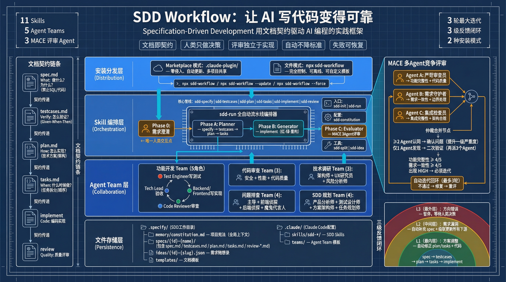
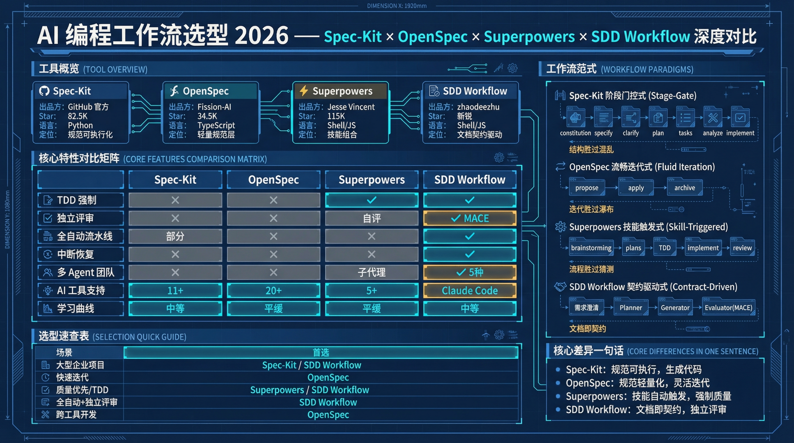

# SDD Workflow

Specification-Driven Development toolkit for [Claude Code](https://claude.ai/claude-code). Install skills, templates, and tooling into any project to bring structured, AI-assisted development to your workflow.

## What is SDD?

SDD (Specification-Driven Development) is a development workflow that writes specifications before code. It combines the discipline of TDD with AI-assisted implementation, enforced through Claude Code skills.

The pipeline:

```
Specify --> Test Cases --> Plan --> Tasks --> Implement --> Review
  (What)     (Verify)    (How)   (When)    (Code)    (Quality)
```

Every phase produces a document. Documents become contracts. AI implements against those contracts. An independent review verifies compliance.

### v5: Self-Review Gate & Pragmatic Review

Building on the Agent-Per-Phase architecture, v5 adds self-review gates, stronger requirement clarification, and pragmatic review thresholds — reducing wasted review iterations while maintaining quality.

Skills are the **single source of truth** for domain logic. Agent prompts (`.specify/templates/agent-prompts/`) are thin shells that reference Skills and add I/O paths.

## Quick Start

### Option A: Install from Marketplace (Recommended)

Add the SDD Workflow marketplace, then install the plugin:

```bash
# Step 1: Add marketplace
claude plugin marketplace add zhaodeezhu/sdd-workflow

# Step 2: Install plugin
claude plugin install sdd-workflow@sdd-workflow
```

Skills are namespaced under `sdd-workflow`:

```
/sdd-workflow:sdd-init        Initialize SDD for your project
/sdd-workflow:sdd-run         Full auto pipeline
/sdd-workflow:sdd-specify     Create specification
/sdd-workflow:sdd-testcases   Design test cases
/sdd-workflow:sdd-plan        Plan implementation
/sdd-workflow:sdd-tasks       Break down tasks
/sdd-workflow:sdd-implement   Execute development
/sdd-workflow:sdd-review      Independent quality review
...
```

Update to latest version:

```bash
claude plugin update sdd-workflow
```

Uninstall:

```bash
claude plugin uninstall sdd-workflow
```

### Option B: Install via npx (File-Based)

Copies skills, templates, and team configurations directly into your project:

```bash
npx sdd-workflow
```

This creates the following structure:

```
your-project/
├── .claude/
│   ├── skills/sdd-*/       11 SDD skills
│   └── teams/               Team configurations
└── .specify/
    ├── memory/              Project constitution (generated later)
    ├── specs/               Feature specifications
    ├── templates/
    │   ├── agent-prompts/   Agent thin-shell templates (10 files)
    │   └── *.md             Document templates
    └── scripts/             Utility scripts
```

Skills are available without namespace prefix:

```
/sdd-init                    Initialize SDD for your project
/sdd-run                     Full auto pipeline
/sdd-specify                 Create specification
...
```

### Initialize & Develop

Regardless of install method, open Claude Code in your project and run:

```
/sdd-init                    # or /sdd-workflow:sdd-init for marketplace users
```

This analyzes your project structure, detects your tech stack, and generates a project-specific constitution at `.specify/memory/constitution.md`.

Then start a feature:

```
# Full auto pipeline
/sdd-run 001 Add user authentication

# Or step through manually
/sdd-specify User authentication
/sdd-testcases
/sdd-plan
/sdd-tasks
/sdd-implement
/sdd-review
```

> **Marketplace users**: prefix all commands with `sdd-workflow:`, e.g. `/sdd-workflow:sdd-run 001 Add user authentication`

## Architecture



## Industry Framework Comparison



## Installation Comparison

| | Marketplace Install | npx Install |
|---|---|---|
| Install | `plugin marketplace add` then `plugin install` | `npx sdd-workflow` |
| Files in project | None | Skills, templates, teams copied to project |
| Skill prefix | `/sdd-workflow:sdd-*` | `/sdd-*` |
| Updates | `plugin update sdd-workflow` | `npx sdd-workflow --update` |
| Customization | Fork the repo | Edit files in `.claude/skills/` |
| Best for | Quick start, always latest | Full control, offline use, custom modifications |

## npx Installation Options

```bash
npx sdd-workflow              # Standard install (skip existing files)
npx sdd-workflow --update     # Incremental update (only changed files)
npx sdd-workflow --force      # Overwrite all existing files
npx sdd-workflow --dry-run    # Preview what would be installed/updated
npx sdd-workflow --update --dry-run  # Preview updates
```

### Update Modes

| Mode | Behavior | When to use |
|------|----------|-------------|
| (default) | Skip existing files | First install |
| `--update` | Only update source-changed files, skip user-customized | After upgrading sdd-workflow |
| `--force` | Overwrite everything | Reset to defaults |

**How `--update` works**: On first install, a manifest (`.specify/.sdd-manifest.json`) records file hashes. When you run `--update`, it compares source files against the manifest:
- Source changed, target is original → auto-update
- Source changed, target also modified by you → **skip** (protect your customizations)
- New files in source → auto-add
- Unchanged → skip

## Available Commands

### Core Pipeline

| Command | Description | Input | Output |
|---------|-------------|-------|--------|
| `/sdd-specify` | Create feature specification | Feature name or KB link | `spec.md` |
| `/sdd-testcases` | Design test cases | spec.md | `testcases.md` |
| `/sdd-plan` | Plan technical implementation | testcases.md + spec.md | `plan.md` |
| `/sdd-tasks` | Break down into development tasks | plan.md | `tasks.md` |
| `/sdd-implement` | Execute development tasks | tasks.md | Code changes |
| `/sdd-review` | Independent quality review | spec + plan + code | Review report |

### Automation

| Command | Description |
|---------|-------------|
| `/sdd-run <id> <description>` | Full auto pipeline: specify through review |
| `/sdd-init` | Initialize SDD for the project (first time only) |
| `/sdd-constitution` | Create or update project constitution |

### Utilities

| Command | Description |
|---------|-------------|
| `/sdd-split` | Split large SDD documents into modular structure |
| `/sdd-notify configure` | Configure Feishu notification for task completion |
| `/sdd-notify test` | Send a test notification |

### Notifications

SDD Workflow can push Feishu messages when long-running tasks (`sdd-run`, `sdd-review`) complete, so you don't need to watch the terminal.

**Setup**:

1. Create a Feishu app at [open.feishu.cn/app](https://open.feishu.cn/app) and grant it `im:message:send_as_bot` permission
2. Run `/sdd-init` and follow the notification setup prompt, **or** run `/sdd-notify configure` at any time
3. Provide App ID, App Secret, and your open_id (obtained via the app's API Explorer)

Configuration is saved to `.specify/notification.json`. Notification failures never interrupt the main workflow.

## Project Constitution

The constitution (`.specify/memory/constitution.md`) is the foundation of SDD in your project. It defines:

- **Tech stack** -- languages, frameworks, libraries detected from your project
- **Absolute rules** -- data integrity, query performance, security baselines
- **Development principles** -- simplicity, code quality, testing standards
- **Architecture constraints** -- based on your project's architecture pattern
- **Review criteria** -- scoring dimensions, weights, and pass thresholds
- **Lessons learned** -- accumulated project-specific knowledge

The constitution is generated by `/sdd-init` and can be updated with `/sdd-constitution`. All subsequent SDD commands read it as context.

## Document Structure

Each feature is organized under `.specify/specs/`:

```
.specify/
├── memory/
│   └── constitution.md          Project constitution
├── templates/
│   └── agent-prompts/           Agent thin-shell templates
└── specs/
    └── 001-feature-name/
        ├── spec.md              What to build
        ├── testcases.md         How to verify
        ├── plan.md              How to implement
        ├── tasks.md             When to implement (task breakdown)
        └── reviews/             Review reports (generated by sdd-run)
            ├── r1/
            │   ├── agent-a.md   Strict reviewer report
            │   ├── agent-b.md   Requirements guardian report
            │   ├── agent-c.md   Integration inspector report
            │   ├── arbitrate.md Arbitration verdict
            │   └── fix-directives.md  Fix instructions (if ITERATE)
            └── summary.md       Final review summary (if PASS)
```

### Document Responsibilities

| Document | Answers | Does NOT contain |
|----------|---------|-----------------|
| `spec.md` | What to build and why | Technical implementation details |
| `testcases.md` | How to verify correctness | Implementation code |
| `plan.md` | How to implement technically | Specific code |
| `tasks.md` | When to implement (task order) | Implementation details |

## How It Works with Claude Code

SDD Workflow provides two installation paths, each with different mechanics:

### Marketplace Mode

1. `claude plugin marketplace add zhaodeezhu/sdd-workflow` registers the marketplace
2. `claude plugin install sdd-workflow@sdd-workflow` installs the plugin from marketplace
3. Claude Code loads skill names/descriptions at session start (progressive disclosure)
4. You invoke a skill with `/sdd-workflow:sdd-<name>`
5. Full skill content loads on demand — no files in your project
6. Skills create `.specify/` directories as needed during execution

### File-Based Mode

1. `npx sdd-workflow` copies skill files into `.claude/skills/`
2. Claude Code discovers skills automatically from that directory
3. You invoke a skill with `/sdd-<name>` in the Claude Code CLI
4. Claude Code reads the skill instructions and follows them
5. Skills reference templates from `.specify/templates/` and the constitution from `.specify/memory/`

### Agent Teams

The package also includes team configurations for multi-agent collaboration. Teams are useful for complex tasks that benefit from multiple perspectives:

- **Feature Development Team** (5 roles) -- full-stack feature implementation
- **Code Review Team** (3 roles) -- security, performance, quality review
- **Debug Team** (4 roles) -- complex bug investigation with adversarial reasoning
- **Research Team** (3 roles) -- technical evaluation and architecture assessment
- **SDD Planning Team** (4 roles) -- collaborative specification and planning

Enable teams by setting `CLAUDE_CODE_EXPERIMENTAL_AGENT_TEAMS=1` in your environment.

## Configuration Guide

### CLAUDE.md Integration

After installation, add a section to your project's `CLAUDE.md` (if it exists) so Claude Code always knows SDD is active:

```markdown
## SDD Workflow

This project uses SDD (Specification-Driven Development).

### Quick Start
1. `/sdd-init` -- Initialize SDD for this project (first time only)
2. `/sdd-run <id> <description>` -- Full auto pipeline (recommended)
3. Or use individual commands: /sdd-specify, /sdd-testcases, /sdd-plan, /sdd-tasks, /sdd-implement, /sdd-review

### Document Structure
- `.specify/memory/constitution.md` -- Project constitution
- `.specify/specs/<id>-<name>/` -- Feature specifications
```

### .gitignore

Consider adding:

```
.specify/specs/              # Feature specs (project-specific, regenerable)
.specify/memory/             # Project memory (local context)
.specify/notification.json   # Notification credentials (sensitive)
```

### Customization

- **Templates**: Edit files in `.specify/templates/` to match your team's documentation style
- **Constitution**: Edit `.specify/memory/constitution.md` to add project-specific rules
- **Skills**: Modify any skill in `.claude/skills/sdd-*/SKILL.md` to adjust behavior

## Requirements

- [Claude Code](https://claude.ai/claude-code) CLI
- Node.js >= 14.0.0 (for installation only)
- Git (recommended)

## License

MIT
